# 🛒 La Tienda del Borojó — 🍃 MongoDB

## 📖 Descripción del proyecto y del escenario

Este repositorio contiene un **mini–ecosistema de MongoDB** 🗄️ diseñado para modelar el flujo de datos de una tienda ficticia 🏬 especializada en la comercialización de productos derivados del **borojó** 🥭, una fruta tropical reconocida por sus propiedades energizantes ⚡ y su valor cultural 🌎 en varias regiones de Latinoamérica.  

El proyecto se centra en cinco colecciones principales 📂 que conforman la base de datos:  

- **📦 Productos:** catálogo de artículos como jugos 🥤, galletas 🍪, polvos energizantes 💥 y otros derivados del borojó.  
- **🧑‍🤝‍🧑 Clientes:** registros de consumidores con datos de contacto 📇, historial de compras 🛍️ y preferencias ⭐.  
- **💳 Ventas:** operaciones realizadas, relacionando clientes 👥 y productos adquiridos 🎁.  
- **🚚 Proveedores:** compañías que abastecen la tienda con productos terminados 📦 o materia prima 🌱.  
- **📊 Inventario:** gestión de stock 📉, lotes 🔖 y entradas de mercancía 📥.  

La práctica busca ejercitar distintos aspectos del manejo de **MongoDB**:  
- ✍️ Operaciones **CRUD básicas**.  
- 🔍 Uso de **expresiones regulares** para consultas textuales.  
- 🧩 Manejo de **operadores sobre arrays**.  
- 📈 **Aggregation Framework** para consultas analíticas.  
- 🛠️ Creación de **funciones personalizadas** en `system.js`.  
- 🤝 Implementación de **transacciones multi-documento**.  
- 🚀 Diseño y evaluación de **índices** para mejorar el rendimiento.  

---

## ⚙️ Preparación del entorno

1. **Instala MongoDB Community Edition** (incluye `mongod` y `mongosh`) desde la [documentación oficial](https://www.mongodb.com/try/download/community).  
2. Instala también **MongoDB Database Tools** si planeas trabajar con `mongoimport` y `mongoexport`.  
3. Clona este repositorio y entra en la carpeta raíz:  
   ```bash
   git clone https://github.com/SantiagoRomero7/TiendaBorojoMongo.git.
   cd TiendaBorojoMongo-main
   ```
4. (Opcional) Crea explícitamente la base de datos:  
   ```bash
   mongosh --eval "use tiendaBorojo"
   ```

> 💡 *Consejo:* se recomienda trabajar en un entorno con al menos MongoDB **v5.0+** para garantizar compatibilidad total con transacciones y operaciones de agregación.

---

## ⬆️ Cargar el dataset

Existen dos métodos principales para poblar la base de datos.

### **Opción A — con `mongoimport` (recomendada):**
```bash
mongoimport --db tiendaBorojo --collection productos   --file dataset/productos.json   --jsonArray
mongoimport --db tiendaBorojo --collection clientes    --file dataset/clientes.json    --jsonArray
mongoimport --db tiendaBorojo --collection ventas      --file dataset/ventas.json      --jsonArray
mongoimport --db tiendaBorojo --collection proveedores --file dataset/proveedores.json --jsonArray
mongoimport --db tiendaBorojo --collection inventario  --file dataset/inventario.json  --jsonArray
```

### **Opción B — desde `mongosh`:**
```javascript
use tiendaBorojo
db.productos.insertMany(JSON.parse(cat('dataset/productos.json')))
db.clientes.insertMany(JSON.parse(cat('dataset/clientes.json')))
db.ventas.insertMany(JSON.parse(cat('dataset/ventas.json')))
db.proveedores.insertMany(JSON.parse(cat('dataset/proveedores.json')))
db.inventario.insertMany(JSON.parse(cat('dataset/inventario.json')))
```

> ✅ Esta segunda opción es útil si no tienes instaladas las herramientas de `mongoimport`.  

---

## ▶️ Cómo ejecutar los scripts

Cada grupo de ejercicios se encuentra modularizado en un archivo `.js`. Para ejecutarlos desde la raíz del repositorio:  

```bash
# Ejemplo: ejecutar inserciones
mongosh "tiendaBorojo" scripts/insercion.js

# Ejecutar cada módulo según el tema
mongosh "tiendaBorojo" scripts/lectura.js
mongosh "tiendaBorojo" scripts/actualizacion.js
mongosh "tiendaBorojo" scripts/eliminacion.js
mongosh "tiendaBorojo" scripts/regex.js
mongosh "tiendaBorojo" scripts/arrays.js
mongosh "tiendaBorojo" scripts/agregation.js
mongosh "tiendaBorojo" scripts/system.js
mongosh "tiendaBorojo" scripts/indexacion.js
```

### ⚠️ Nota sobre transacciones
Para ejecutar `transacciones.js`, es indispensable contar con un **Replica Set** activo.  
En local puedes iniciar uno de un solo nodo:  
```bash
mongod --replSet rs0 --dbpath ./data --bind_ip 127.0.0.1
mongosh --eval "rs.initiate()"
```
Luego:  
```bash
mongosh "tiendaBorojo" scripts/transacciones.js
```

---

## 📂 Estructura del repositorio

```
📦 TiendaBorojoMongo-main
┣ 📁 dataset
┃ ┣ 📄 clientes.json
┃ ┣ 📄 inventario.json
┃ ┣ 📄 productos.json
┃ ┣ 📄 proveedores.json
┃ ┗ 📄 ventas.json
┣ 📁 scripts
┃ ┣ 📄 actualizacion.js
┃ ┣ 📄 agregation.js
┃ ┣ 📄 arrays.js
┃ ┣ 📄 eliminacion.js
┃ ┣ 📄 indexacion.js
┃ ┣ 📄 insercion.js
┃ ┣ 📄 lectura.js
┃ ┣ 📄 regex.js
┃ ┣ 📄 system.js
┃ ┗ 📄 transacciones.js
┣ 📁 capturas
┃ ┣ 📄 consulta-1.png
┃ ┣ 📄 consulta-2.png
┃ ┣ 📄 consulta-3.png
┃ ┣ 📄 consulta-4.png
┃ ┣ 📄 consulta-5.png
┃ ┣ 📄 consulta-6.png
┃ ┣ 📄 consulta-7.png
┃ ┣ 📄 consulta-8.png
┃ ┣ 📄 consulta-9.png
┃ ┣ 📄 consulta-10.png
┃ ┣ 📄 consulta-11.png
┃ ┣ 📄 consulta-12.png
┃ ┗ 📄 consulta-13.png
┗ 📄 README.md
```

---

## ✅ Listado de ejercicios y archivos

Cada bloque incluye la explicación del objetivo, su importancia en un entorno real y el script donde fue implementado.

### 🔹 Inserción — `scripts/insercion.js`
- Agrega **"Chocolatina de borojó"** a `productos` y el cliente **"Mario Mendoza"**.  
- Objetivo: practicar `insertOne`/`insertMany`, garantizar consistencia de datos y validar la estructura del documento.

### 🔹 Lectura — `scripts/lectura.js`
- Consulta de productos con `stock > 20`.  
- Listado de clientes con **cero compras** (`$size: 0`).  
- Objetivo: desarrollar filtros simples, aplicar proyecciones y explorar selectividad.

### 🔹 Actualización — `scripts/actualizacion.js`
- Incrementa stock de **"Borojó deshidratado"** (`$inc`).  
- Añade tag **"bajo azúcar"** a bebidas (`$addToSet`).  
- Objetivo: realizar actualizaciones atómicas y aplicar condiciones de negocio.

### 🔹 Eliminación — `scripts/eliminacion.js`
- Elimina un cliente por `email`.  
- Elimina productos con `stock < 5`.  
- Objetivo: controlar eliminaciones masivas de forma segura (`deleteOne`/`deleteMany`).

### 🔹 Expresiones Regulares — `scripts/regex.js`
- Búsqueda de nombres que **empiecen** por `Boro`.  
- Búsqueda de productos que **contengan** `"con"`.  
- Filtrado de clientes con la letra `z` (case-insensitive).  
- Objetivo: consultas textuales más flexibles en campos de texto.

### 🔹 Operadores en Arrays — `scripts/arrays.js`
- Clientes que tengan `"natural"` en `preferencias`.  
- Productos que cumplan con `["natural","orgánico"]` (`$all`).  
- Validación de productos con **más de un tag** (`$size`).  
- Objetivo: demostrar el poder de MongoDB para manejar datos semiestructurados.

### 🔹 Aggregation Framework — `scripts/agregation.js`
- **Productos más vendidos** (`$group` + `$sum`).  
- **Clientes por cantidad de compras** (`$group`).  
- **Ventas por mes** (`$month`).  
- **Promedio de precios por categoría** (`$avg`).  
- **Top 3** productos por `stock` (`$sort` + `$limit`).  
- Objetivo: aplicar análisis en tiempo real sin necesidad de herramientas externas.

### 🔹 Funciones en `system.js` — `scripts/system.js`
- `calcularDescuento(precio, porcentaje)`: retorna precio final.  
- `clienteActivo(idCliente)`: devuelve `true` si el cliente supera cierto umbral de compras.  
- `verificarStock(productoId, cantidadDeseada)`: evalúa disponibilidad de inventario.  
- Objetivo: encapsular lógica de negocio en funciones reutilizables.

### 🔹 Transacciones — `scripts/transacciones.js`
- **Venta**: descuenta stock e inserta en `ventas`.  
- **Entrada de inventario**: registra el lote y actualiza existencias.  
- **Devolución**: repone stock y elimina la venta asociada.  
- Objetivo: garantizar atomicidad de operaciones complejas.

### 🔹 Indexación — `scripts/indexacion.js`
- Índice en `productos.nombre`.  
- Índice compuesto `productos(categoria, precio)`.  
- Índice en `clientes.email`.  
- Verificación con `explain("executionStats")`.  
- Objetivo: demostrar cómo los índices mejoran la velocidad de búsqueda y reducen el consumo de recursos.
---
## 🧪 Explicacion

### 🔹 `insercion.js` — Actualizaciones  
```javascript
// 1. Insertar un nuevo producto
db.productos.insertOne({
    nombre: "Chocolatina de borojó",
    categoria: "Snack",
    precio: 4000,
    stock: 35,
    tags: ["dulce", "energía"]
});

// 2. Insertar un nuevo cliente
db.clientes.insertOne({
    nombre: "Mario Mendoza",
    email: "mario@email.com",
    compras: [],
    preferencias: ["energético", "natural"]
});

```
**Explicación:**  
- Se agrega un producto nuevo al catálogo con información detallada.
- Se registra un cliente con sus datos de contacto y preferencias iniciales. 
---

### 🔹 `lectura.js` — Consultas básicas  
```javascript
// 1. Productos con stock > 20
db.productos.find({ stock: { $gt: 20 } });

// 2. Clientes sin compras
db.clientes.find({ compras: { $size: 0 } });
```
**Explicación:**  
- Recupera los productos con más de 20 unidades disponibles (`$gt`).  
- Lista clientes que no han realizado compras (`$size: 0`).  

---

### 🔹 `actualizacion.js` — Actualizaciones  
```javascript
// 1. Aumentar en 10 el stock del "Borojó deshidratado"
db.productos.updateOne(
  { nombre: "Borojó deshidratado" },
  { $inc: { stock: 10 } }
);

// 2. Añadir tag "bajo azúcar" a todas las bebidas
db.productos.updateMany(
  { categoria: "Bebida" },
  { $addToSet: { tags: "bajo azúcar" } }
);
```
**Explicación:**  
- Usa `$inc` para incrementar el **stock** de un producto específico de forma **atómica**.  
- Emplea `$addToSet` para **agregar el tag** sin duplicarlo en todos los productos de la categoría **Bebida**.  

---

### 🔹 `eliminacion.js` — Eliminaciones  
```javascript
// 1. Eliminar cliente con correo específico
db.clientes.deleteOne({ email: "juan@email.com" });

// 2. Eliminar productos con stock < 5
db.productos.deleteMany({ stock: { $lt: 5 } });
```
**Explicación:**  
- `deleteOne` elimina un cliente puntual.  
- `deleteMany` limpia productos con poco inventario.  

---
### 🔹 regex.js — Consultas con expresiones regulares
```javascript
// 1. Productos cuyo nombre empiece por "Boro"
db.productos.find({ nombre: { $regex: /^Boro/ } });

// 2. Productos cuyo nombre contenga la palabra "con"
db.productos.find({ nombre: { $regex: "con", $options: "i" } });

// 3. Clientes cuyo nombre tenga la letra "z" (insensible a mayúsculas/minúsculas)
db.clientes.find({ nombre: { $regex: /z/i } });

```
**Explicación:**  
- Filtra productos cuyo nombre empieza con la palabra "Boro".
- Busca productos que incluyan "con" en cualquier parte del nombre (sin importar mayúsculas o minúsculas). 
- Encuentra clientes con nombres que contengan la letra "z".
---
### 🔹 `arrays.js` — Consultas sobre arreglos  
```javascript
// 1. Clientes con "natural" en preferencias
db.clientes.find({ preferencias: "natural" });

// 2. Productos con "natural" y "orgánico"
db.productos.find({ tags: { $all: ["natural", "orgánico"] } });

// 3. Productos con más de un tag
db.productos.find({ "tags.1": { $exists: true } });
```
**Explicación:**  
- Consulta clientes con preferencias específicas.  
- Busca productos que tengan simultáneamente `"natural"` y `"orgánico"`.  
- Valida productos con múltiples etiquetas (`tags`).  

---

### 🔹 `agregation.js` — Aggregation Framework  
```javascript
// 1. Productos más vendidos
db.ventas.aggregate([
  { $unwind: "$productos" },
  { $group: { _id: "$productos.productoId", totalVendido: { $sum: "$productos.cantidad" } } },
  { $sort: { totalVendido: -1 } }
]);
```
**Explicación:**  
- Descompone (`$unwind`) los productos de cada venta.  
- Agrupa por producto y suma cantidades.  
- Ordena para mostrar los más vendidos.  

```javascript
// 2. Agrupar clientes por cantidad de compras realizadas
db.clientes.aggregate([
  { $project: { nombre: 1, totalCompras: { $size: "$compras" } } },
  { $group: { _id: "$totalCompras", clientes: { $push: "$nombre" } } },
  { $sort: { _id: 1 } }
]);
```
**Explicación:**  
- Calcula compras de cada cliente.  
- Agrupa clientes por cantidad de compras.  

```javascript
// 3. Total de ventas por mes
db.ventas.aggregate([
  { $group: {
      _id: { anio: { $year: { $toDate: "$fecha" } }, mes: { $month: { $toDate: "$fecha" } } },
      totalVentas: { $sum: "$total" }
    }
  },
  { $sort: { "_id.anio": 1, "_id.mes": 1 } }
]);
```
**Explicación:**  
- Agrupa ventas por año y mes.  
- Calcula el total de ventas mensuales.  

```javascript
// 4. Promedio de precios por categoría
db.productos.aggregate([
  { $group: { _id: "$categoria", promedioPrecio: { $avg: "$precio" } } },
  { $sort: { promedioPrecio: -1 } }
]);
```
**Explicación:**  
- Calcula promedios de precio por categoría.  

```javascript
// 5. Top 3 productos con mayor stock
db.productos.aggregate([
  { $sort: { stock: -1 } },
  { $limit: 3 },
  { $project: { _id: 0, nombre: 1, stock: 1 } }
]);
```
**Explicación:**  
- Muestra los tres productos con más unidades disponibles.  

---

### 🔹 `indexacion.js` — Índices  
```javascript
// Índice simple en nombre
db.productos.createIndex({ nombre: 1 });

// Índice compuesto categoria + precio
db.productos.createIndex({ categoria: 1, precio: 1 });

// Índice único en email
db.clientes.createIndex({ email: 1 }, { unique: true });

// Comprobar uso de índice
db.productos.find({ nombre: "Borojó fresco" }).explain("executionStats");
```
**Explicación:**  
- Mejora consultas frecuentes con índices.  
- Usa `explain("executionStats")` para verificar el plan de ejecución.  

---

### 🔹 `system.js` — Funciones almacenadas  
```javascript
// Calcular descuento
db.system.js.save({
  _id: "calcularDescuento",
  value: function(precio, porcentaje) {
    return precio - (precio * porcentaje / 100);
  }
});
```
**Explicación:** Calcula un precio final aplicando un descuento.  

```javascript
// Cliente activo
db.system.js.save({
  _id: "clienteActivo",
  value: function(idCliente) {
    const cliente = db.clientes.findOne({ _id: idCliente });
    return cliente.compras.length > 3;
  }
});
```
**Explicación:** Determina si un cliente es “activo” (más de 3 compras).  

```javascript
// Verificar stock
db.system.js.save({
  _id: "verificarStock",
  value: function(productoId, cantidadDeseada) {
    const producto = db.productos.findOne({ _id: productoId });
    return producto.stock >= cantidadDeseada;
  }
});
```
**Explicación:** Comprueba si hay suficiente stock disponible.  

---

### 🔹 `transacciones.js` — Transacciones (venta, entrada, devolución)  
```javascript
// === TRANSACCIONES EN MongoDB ===
// Base de datos: tiendaBorojo

// -------------------------------------------
// 1. SIMULAR UNA VENTA
// -------------------------------------------
const session1 = db.getMongo().startSession();
session1.startTransaction();

try {
  const tienda = session1.getDatabase("tiendaBorojo");

  // a) Descontar stock
  tienda.productos.updateOne(
    { _id: 1 },
    { $inc: { stock: -1 } }
  );

  // b) Insertar venta con _id controlado
  tienda.ventas.insertOne({
    _id: 101,
    clienteId: 1,
    productos: [{ productoId: 1, cantidad: 1 }],
    fecha: new Date(),
    total: 5000
  });

  session1.commitTransaction();
  print("✅ Venta registrada");
} catch (e) {
  print("❌ Error en la venta:", e);
  session1.abortTransaction();
}
session1.endSession();


// -------------------------------------------
// 2. SIMULAR LA ENTRADA DE NUEVO INVENTARIO
// -------------------------------------------
const session2 = db.getMongo().startSession();
session2.startTransaction();

try {
  const tienda = session2.getDatabase("tiendaBorojo");

  // a) Registrar entrada
  tienda.inventario.insertOne({
    productoId: 1,
    cantidad: 10,
    fecha: new Date(),
    proveedor: "ProveedorX"
  });

  // b) Aumentar stock
  tienda.productos.updateOne(
    { _id: 1 },
    { $inc: { stock: 10 } }
  );

  session2.commitTransaction();
  print("✅ Entrada de inventario registrada");
} catch (e) {
  print("❌ Error en entrada inventario:", e);
  session2.abortTransaction();
}
session2.endSession();


// -------------------------------------------
// 3. SIMULAR UNA DEVOLUCIÓN
// -------------------------------------------
const session3 = db.getMongo().startSession();
session3.startTransaction();

try {
  const tienda = session3.getDatabase("tiendaBorojo");

  // a) Aumentar stock
  tienda.productos.updateOne(
    { _id: 1 },
    { $inc: { stock: 1 } }
  );

  // b) Eliminar la venta (usamos la que creamos con _id = 101)
  tienda.ventas.deleteOne({ _id: 101 });

  session3.commitTransaction();
  print("✅ Devolución realizada");
} catch (e) {
  print("❌ Error en la devolución:", e);
  session3.abortTransaction();
}
session3.endSession();
```
**Explicación:**  
- Se crean **sesiones** (`startSession`) y se inicia una **transacción** (`startTransaction`).  
- **Venta**: descuenta stock e inserta un documento en `ventas`.  
- **Entrada de inventario**: registra entrada en `inventario` y aumenta stock.  
- **Devolución**: repone stock y elimina la venta creada.  
- En cada caso, se usa `commitTransaction()` para confirmar o `abortTransaction()` ante errores.  
- **Requiere Replica Set** para funcionar.  


---

## 📷 Evidencias (consultas)

### Lectura

#### 1) Productos con stock > 20
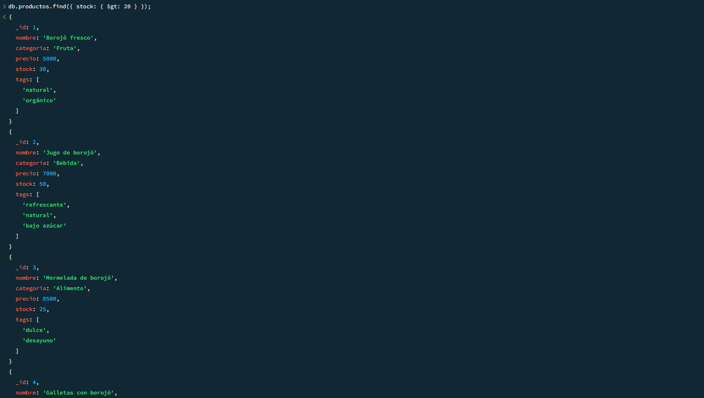

#### 2) Clientes sin compras
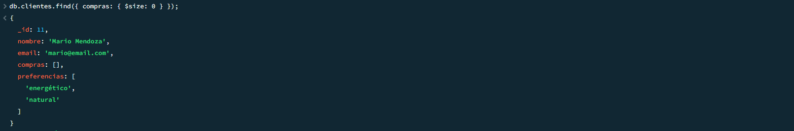

---

### Consultas con Expresiones Regulares

#### 1) Productos cuyo nombre empiece por "Boro"
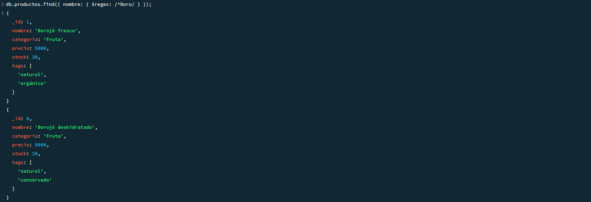

#### 2) Productos cuyo nombre contenga "con"
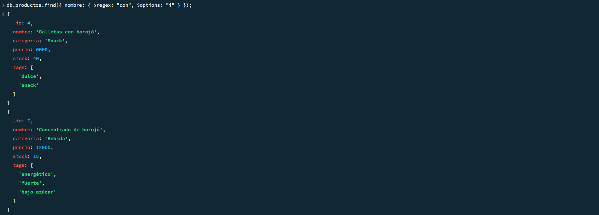

#### 3) Clientes cuyo nombre tenga la letra "z"
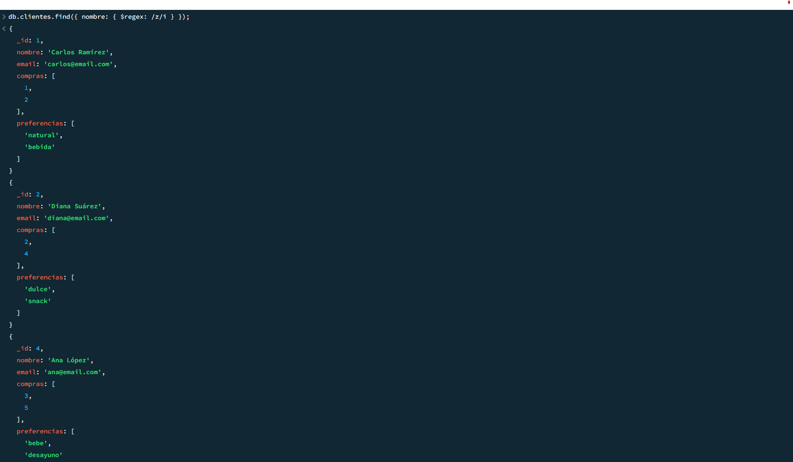

---

### Operadores en consultas sobre arrays

#### 1) Clientes con "natural" en sus preferencias
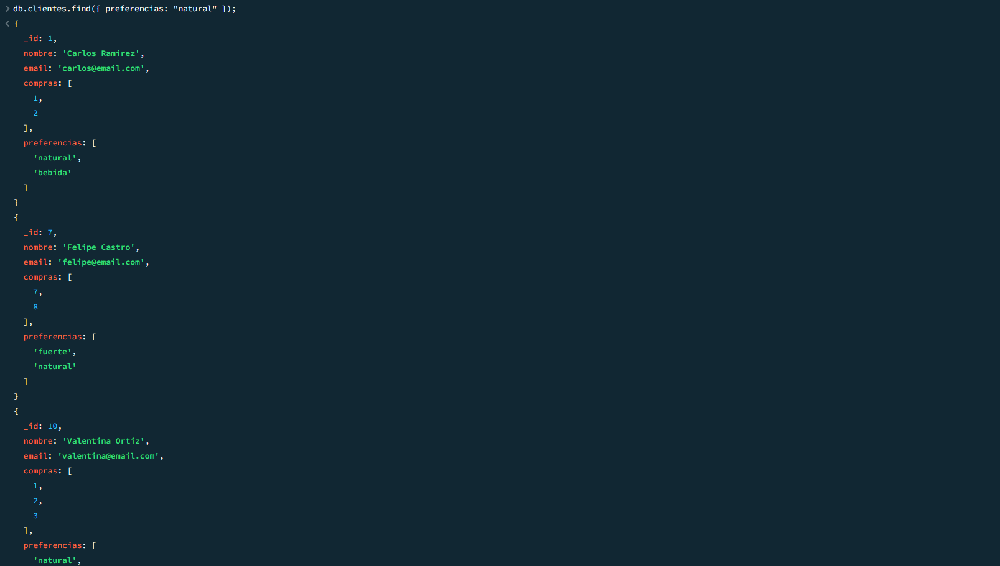

#### 2) Productos con los tags "natural" y "orgánico" ($all)
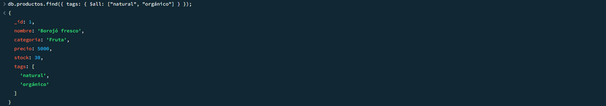

#### 3) Productos con más de un tag
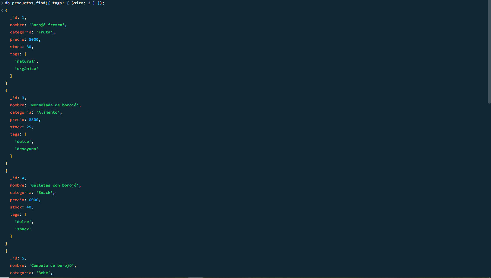

---

### Aggregation Framework con Pipelines

#### 1) Productos más vendidos (suma de unidades)
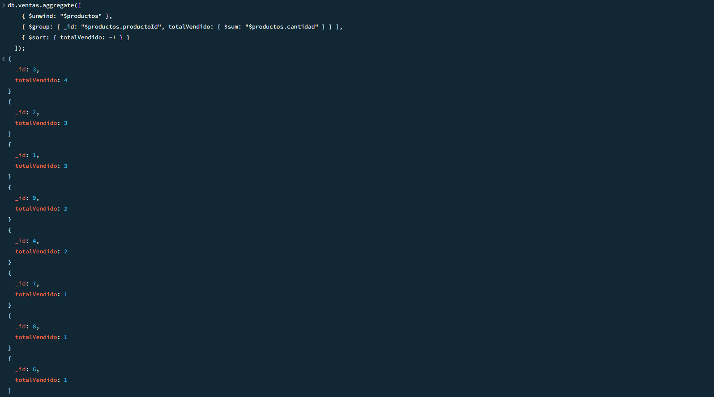

#### 2) Clientes agrupados por cantidad de compras
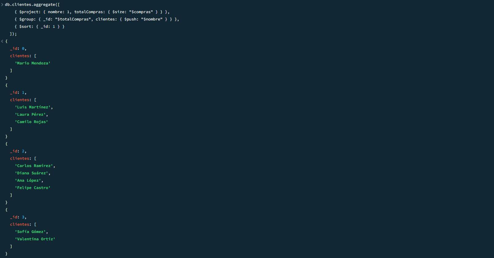

#### 3) Total de ventas por mes
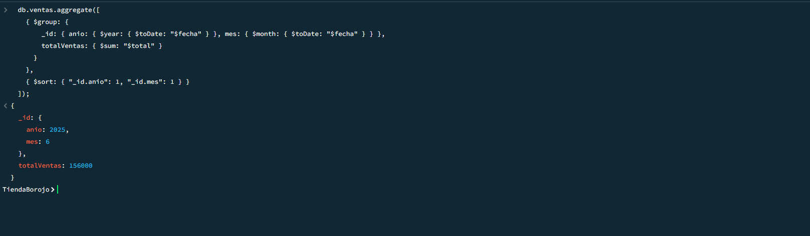

#### 4) Promedio de precios por categoría
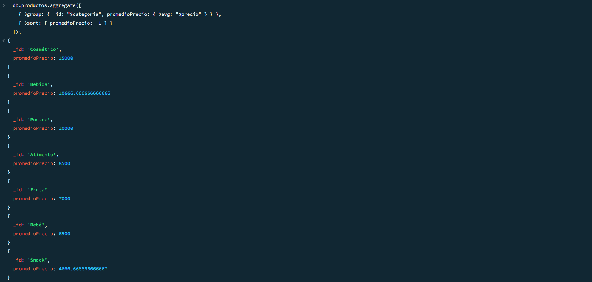

#### 5) Top 3 productos con mayor stock
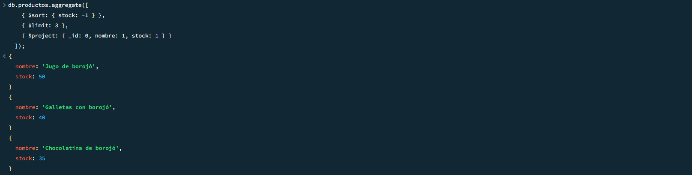


---

# 🏁 Conclusión

Este proyecto permitió integrar, de manera práctica y ordenada, los principales fundamentos y técnicas avanzadas del ecosistema **MongoDB**, consolidando conocimientos esenciales para el trabajo con bases de datos NoSQL en contextos reales.  

A través de la simulación de una tienda dedicada a la comercialización de productos derivados del **borojó**, se abordaron los siguientes aspectos:  

- **CRUD básico y avanzado**, consolidando la capacidad de realizar inserciones, consultas, actualizaciones y eliminaciones de manera atómica y controlada.  
- Uso de **expresiones regulares** para potenciar la búsqueda textual y enriquecer las consultas sobre los datos almacenados.  
- Manejo de **operadores en arrays**, lo cual facilitó explorar escenarios más dinámicos donde los atributos no son estáticos, sino colecciones flexibles de información.  
- Implementación de **Aggregation Pipelines**, que permitió realizar análisis estadísticos, resúmenes de ventas, identificación de tendencias de consumo y clasificación de productos.  
- Desarrollo de **funciones en `system.js`**, lo que introdujo una capa de lógica reutilizable dentro de la propia base de datos, potenciando la eficiencia y la coherencia.  
- **Transacciones multi-documento**, aplicadas a escenarios de venta, devoluciones e inventario, que garantizaron la atomicidad y confiabilidad de los procesos críticos del negocio.  
- **Indexación estratégica**, clave para optimizar consultas y asegurar un rendimiento escalable frente al crecimiento de la información.  

Más allá del aspecto técnico, este trabajo representa un ejercicio de **pensamiento crítico y modelado de información**, donde cada decisión de diseño tiene un impacto directo en la facilidad de consulta, la escalabilidad y la solidez del sistema.  
De esta manera, la experiencia no solo enriquece el dominio de MongoDB, sino que también refuerza competencias transversales en la gestión de proyectos de datos: desde la estructuración de colecciones y datasets iniciales hasta la optimización y documentación final.  

En conclusión, el proyecto de **La Tienda del Borojó** simboliza cómo una base de datos bien estructurada puede convertirse en el corazón de un ecosistema digital, capaz de sostener procesos de negocio, análisis de información y toma de decisiones.  


---

# 📌 Notas

- Se recomienda MongoDB **≥ 4.2** para ejecutar transacciones.  
- En Windows, utilizar **PowerShell** o **CMD** desde la raíz del proyecto para que las rutas relativas funcionen correctamente.  
- Para exportar resultados a JSON o CSV:  
  ```bash
  mongoexport --db tiendaBorojo --collection productos --out productos.csv --type=csv
  ```
- También puedes usar en `mongosh`:  
  ```javascript
  db.productos.find().toArray().forEach(printjson)
  ```

---
## 👨‍💻 DESARROLLADORES

-🧑‍💻 Ricardo Palomino  
-🧑‍💻 Santiago Romero  


> ✨ "Los datos son como semillas: bien cuidados, crecen en conocimiento; mal gestionados, se marchitan en el olvido."